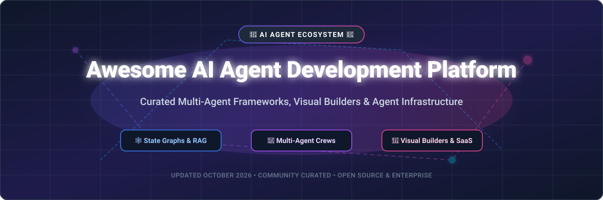

# Awesome-AI-Agent-Development-Platform 🤖 🛠️

  

  
  
  
  
  

---

## 🌟 Top AI Agent Development Platform Ecosystem 🚀

**The Ultimate Curated List of Commercial Agent Development Platforms, Visual AI Workflow Builders & Open-Source Multi-Agent Frameworks** 🤖  
*Focused on Multi-Agent Orchestration, Visual Workflow Builders, Agent Runtimes, Tool Integration, Memory, Autonomous Coding & Self-Hosted Agent Development Infrastructure* 🛠️

**Last updated: October 2026** 📅

---

### 📌 Overview & SEO Summary 🔍
Welcome to the definitive directory of **AI agent development platforms**, **open-source multi-agent orchestration frameworks**, and **visual AI agent builders**. Designed for AI software engineers, enterprise architects, and AI founders, this guide compares commercial enterprise platforms (such as *Microsoft Copilot Studio*, *Salesforce Agent Studio*, *Dify Cloud*, and *Stack AI*) alongside self-hostable open-source alternatives (like *Dify*, *LangGraph*, *AutoGPT*, *MetaGPT*, *CrewAI*, and *LlamaIndex Workflows*).

**Key Market Insights & Trends (2026):** 💡
- 🕸️ **LangGraph** leads production enterprise agent deployments due to its **state-graph architecture**, time-travel debugging, persistent checkpointing, and human-in-the-loop control.
- 🎨 **Dify** remains the **#1 visual agent builder and LLMOps platform** with **157K+ GitHub_Stars**, offering RAG pipelines, prompt IDE, and multi-model routing.
- 👥 **CrewAI** offers rapid prototyping with role-based agent DSLs (~20 lines of code to deploy working multi-agent crews).
- 🏛️ **AutoGen** pioneered multi-agent conversation models, with Microsoft strategically evolving toward **Microsoft Agent Framework**.
- 🛠️ **Emerging Frameworks** like **LlamaIndex Workflows**, **SuperAGI**, **Semantic Kernel**, and **CAMEL-AI** are expanding autonomous tools, memory backends, and multi-agent communication protocols.

---

## 📑 Table of Contents 📖
- [🏢 SaaS & Commercial Platforms](#-saas--commercial-platforms)
- [🔓 Open-Source GitHub Projects](#-open-source-github-projects)
- [🛠️ How to Contribute](#%EF%B8%8F-how-to-contribute)
- [📊 Star History](#-star-history)
- [🤝 Support & Sponsorship](#-support--sponsorship)
- [⚠️ Disclaimer](#%EF%B8%8F-disclaimer)

---

## 🏢 SaaS / Commercial Platforms 💼

**Market Size & Industry Structure:** 📊  
The global AI agent development platform market is valued at **~$10.75 Billion - $14.62 Billion (2025–2026)** and projected to exceed **$66+ Billion by 2031**. The market exhibits **high fragmentation** across specialized AI startups, visual workflow tools, and open-source orchestration engines, alongside **emerging concentration at the top** led by cloud hyperscalers (Microsoft, Salesforce) and category-defining AI platforms.

| SaaS / Commercial Platform | Company / Owner | Company Size (Valuation / Market Cap) | Standard Edition Starting Price | Free Tier / Free Trial Limits | Description |
| :--- | :--- | :--- | :--- | :--- | :--- |
| **[Microsoft Copilot Studio](https://www.microsoft.com/en-us/microsoft-copilot/microsoft-copilot-studio)** 🔷 | Microsoft | **~$3.90 Trillion** (Market Cap) | **$200/month** (includes 25,000 messages) | **30-day Free Trial** (Full studio access, 10,000 test messages) | **Microsoft-native agent development** — **Low-code agents across Microsoft 365, websites, and external systems**. **Multi-agent orchestration and handoffs**. **Power Platform governance**. |
| **[Salesforce Agent Studio](https://www.salesforce.com/agentforce/)** ☁️ | Salesforce | **~$250 Billion** (Market Cap) | **$500 per 100,000 Flex Credits** ($0.10/action) or **$2.00/conversation** | **Free Foundations Tier** (200,000 free Flex Credits for Enterprise Edition orgs) | **Enterprise agent development** — **Agent Builder for Salesforce admins**. **Deep CRM integration**. **Agent Script and Prompt Builder** for customization. |
| **[Dify Cloud](https://dify.ai/)** 🎨 | Dify | **~$180 Million** (Valuation) | **$59/month** (Professional tier) | **Free Sandbox Plan** (200 message credits, 1 app workspace, 5 vector storage credits) | **LLMOps platform with visual workflow builder** — **Drag-and-drop workflow editor**. **Built-in RAG pipelines**. **100+ LLM providers**. **Observability dashboard**. |
| **[Botpress](https://botpress.com/)** 💬 | Botpress | **~$120 Million** (Valuation) | **$89/month** (Plus plan) | **Free Forever Tier** (500 incoming messages/month, $5 monthly AI credit allowance, 1 seat) | **Chatbot platform** — **Visual flow builder with built-in NLU**. **Multi-channel deployment**. |
| **[Voiceflow](https://www.voiceflow.com/)** 🎙️ | Voiceflow | **~$105 Million** (Valuation) | **$60/month** (Pro plan) | **Free Starter Plan** (2 agents, 1,000 interactions/month, 50MB knowledge base) | **Conversational agent builder** — **Design, prototype, and launch chat and voice agents**. **Collaborative team workspace**. |
| **[Stack AI](https://www.stack-ai.com/)** 📚 | Stack AI | **~$75 Million** (Acquisition Price by Asana) | **$199/month** (Starter plan) | **Free Forever Tier** (500 workflow runs/month, 2 projects, 1 seat) | **Enterprise agent development** — **No-code agent development with enterprise security**. **Document processing and RAG**. |
| **[Fixie.ai](https://fixie.ai/)** 💬 | Fixie.ai | **~$50 Million** (Acquired by Inworld AI) | **$100/month** (Pro plan) | **Free Starter Tier** (30 free minutes/month, 1 concurrent session) | **AI agent platform** — **Build and deploy conversational agents**. **Tool integration and orchestration**. |
| **[CrewAI Cloud](https://crewai.com/)** 👥 | CrewAI | **~$40 Million** ($18M Raised) | **$0.50 per execution overage** (Pay-as-you-go) | **Free Basic Plan** (50 workflow executions/month, visual editor, AI copilot) | **Multi-agent orchestration** — **Role-based agent crews**. **Visual editor and AI copilot**. **Enterprise governance with SSO, RBAC, and PII redaction**. |
| **[Relevance AI](https://relevanceai.com/)** 📊 | Relevance AI | **~$35 Million** ($24M Raised) | **$19/month** (Pro, billed annually) | **Free Forever Tier** (200 execution actions/month, 1 seat) | **AI workforce platform** — **Build agents to handle GTM workloads**. **2,000+ app integrations**. |
| **[SuperAGI Cloud](https://superagi.com/)** 🦾 | SuperAGI | **~$15 Million** (Early Stage) | **$49/month** (Pro plan) | **Free Forever Plan** (100 AI credits/month, 25 prospects/day limit, 2 agents) | **Autonomous agent platform** — **Build, manage, and run autonomous agents**. **Tool marketplace and agent templates**. |

---

## 🔓 Open-Source GitHub Projects ⚡

*Sorted strictly by GitHub_Stars_Count (Descending)* 🌟

- **[AutoGPT](https://github.com/Significant-Gravitas/AutoGPT)**   
  **Autonomous AI agent platform and builder**, MIT licensed. **172K+ GitHub_Stars** — **the iconic open-source autonomous agent benchmark**. **AutoGPT Forge framework**, **visual agent builder**, and **modular tool ecosystem** for autonomous task execution. 🤖

- **[Dify](https://github.com/langgenius/dify)**   
  **LLMOps platform with agentic workflows**, Apache-2.0 licensed. **157K+ GitHub_Stars** — **the leading open-source visual agent builder**. **Visual drag-and-drop workflow editor**, **built-in RAG pipelines**, **100+ LLM integrations**, and **Backend-as-a-Service architecture**. 🎨

- **[LangChain](https://github.com/langchain-ai/langchain)**   
  **Building applications with LLMs through composability**, MIT licensed. **108K+ GitHub_Stars** — **the foundational framework for context-aware agentic applications**, **vector store integrations**, and **tool abstraction layers**. 🔗

- **[MetaGPT](https://github.com/geekan/MetaGPT)**   
  **Multi-agent framework with role-based collaboration**, MIT licensed. **70K+ GitHub_Stars** — **agents role-play a complete software engineering company** (Product Managers, Architects, Developers, Testers) with Standardized Operating Procedures (SOPs). 🏢

- **[AutoGen](https://github.com/microsoft/autogen)**   
  **Conversational multi-agent systems framework**, CC-BY-4.0 licensed. **61K+ GitHub_Stars** — **Microsoft's multi-agent conversation engine**. Features **AutoGen Studio no-code GUI**, flexible multi-agent interaction patterns, and human-in-the-loop controls. 🏛️

- **[CrewAI](https://github.com/crewAIInc/crewAI)**   
  **Framework for orchestrating role-playing autonomous AI agents**, MIT licensed. **59K+ GitHub_Stars** — **the fastest Python framework to prototype multi-agent crews**. Role-based DSL (role, goal, backstory, tools) with task delegation and sequential/hierarchical execution flows. 👥

- **[LangGraph](https://github.com/langchain-ai/langgraph)**   
  **Stateful production agent orchestration via graph architectures**, MIT licensed. **22K+ GitHub_Stars** — **the premier enterprise production framework**. Features state graph models, cycles, branching, persistent memory checkpoints, time-travel debugging, and granular human-in-the-loop state modification. 🕸️

- **[Semantic Kernel](https://github.com/microsoft/semantic-kernel)**   
  **Integrate cutting-edge LLM technology into C#, Python, and Java apps**, MIT licensed. **22K+ GitHub_Stars** — **Microsoft's enterprise SDK** for building agentic plugins, memory connectors, planners, and agent personas in production software. ⚡

- **[CAMEL](https://github.com/camel-ai/camel)**   
  **Communicative agents for mind exploration in agent society**, Apache-2.0 licensed. **17K+ GitHub_Stars** — **pioneer multi-agent framework** focused on role-playing agent societies, communicative agent simulation, and task-oriented collaboration. 🐪

- **[SuperAGI](https://github.com/TransformerOptimus/SuperAGI)**   
  **Dev-first open-source autonomous AI agent framework**, Apache-2.0 licensed. **16K+ GitHub_Stars** — **infrastructure to build, manage, and run autonomous agents**. Includes agent GUI, action console, multiple vector DB support, and reusable tool marketplace. 🦾

- **[LlamaIndex Workflows](https://github.com/run-llama/llama_index)**   
  **Event-driven agentic workflows and data frameworks**, MIT licensed. **37K+ GitHub_Stars** — **event-driven orchestration for RAG agents and data-intensive workflows**, featuring step-based state management and async event loops. 🦙

- **[PraisonAI](https://github.com/MervinPraison/PraisonAI)**   
  **Multi-agent workflows with self-reflection & Low-Code YAML setup**, MIT licensed. **9K+ GitHub_Stars**. Simplifies multi-agent creation with single-command YAML configurations, self-reflection capabilities, and 100+ LLM integrations. 🔄

- **[OpenAgents](https://github.com/xlang-ai/OpenAgents)**   
  **Open platform for language agents in the wild**, Apache-2.0 licensed. **4K+ GitHub_Stars**. Supports data analysis agents, web browsing agents, and tool agents over WebSocket, gRPC, and A2A protocols. 🌐

- **[Atomic Agent](https://github.com/AtomicBot-ai/atomic-agent)**   
  **Local-first CLI agent for open-weight models**, MIT licensed. **2.7K+ GitHub_Stars**. Lightweight modular agent runner for Ollama, LM Studio, and local LLM backends. 🖥️

- **[CAMEL-AI OWL](https://github.com/camel-ai/owl)**   
  **Optimized workforce learning for general multi-agent assistance**, Apache-2.0 licensed. **1.5K+ GitHub_Stars**. Multi-agent workforce framework for real-world automated problem solving. 🦉

- **[Flock](https://github.com/whiteducksoftware/flock)**   
  **Declarative agent orchestration via blackboard architecture**, MIT licensed. **122 GitHub_Stars**. Focuses on declarative agent definitions and shared blackboard state communication. 🐑

- **[Hivekeep](https://github.com/MarlBurroW/hivekeep)**   
  **Self-hosted team of persistent personal agents**, MIT licensed. **68 GitHub_Stars**. Lightweight persistent multi-agent desktop setup. 🐝

---

## 🛠️ How to Contribute 🤝

Contributions are welcome! Follow these steps to submit new AI agent development platforms or open-source agent frameworks: 🚀

1. 🍴 **Fork** the repository.
2. 📝 **Add/edit** entries in `README.md` maintaining table/list structure and formatting.
3. 🔗 Include project title, official website/GitHub link, exact Stars_Count, license, and brief description.
4. 🚀 Submit a **Pull Request** with a descriptive summary of your changes.

---

## 📊 Star History 🌟

---

## 🤝 Support & Sponsorship ☕

If you find this AI agent development platform repository useful, please consider supporting the project:

- ⭐ **Star** this repository to increase visibility!
- 🔀 **Fork** and share with fellow AI engineers, developers, and open-source advocates.
- ☕ **Sponsor & Buy Me a Coffee**: Support ongoing open-source curation via the [GitHub Sponsor Dashboard](https://github.com/sponsors/ishandutta2007). Thank you for empowering open-source AI developer tooling! ❤️

---

## ⚠️ Disclaimer ℹ️

- This is a **community-curated** list — not exhaustive and not an endorsement. ℹ️
- **LangGraph has gained massive enterprise adoption** for production agent graph state control, while **CrewAI is favored for rapid multi-agent prototyping**.
- **Dify is the leading open-source visual agent builder** with 157K+ GitHub_Stars.
- **Open-source agent frameworks require ongoing infrastructure maintenance**, LLM API key management, and evaluation benchmarks. Always test security, memory leakage, and multi-agent loops before production deployment. 🤖

---

  <b>Made with ❤️ for AI engineers, developers, and open-source agent development advocates.</b>

